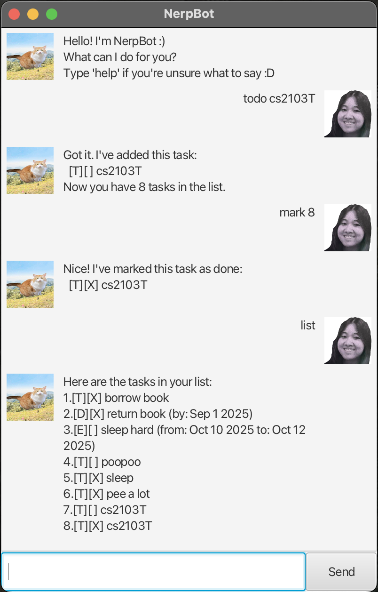

# NerpBot 🤖

NerpBot is a **desktop task manager chatbot** built with Java and JavaFX.  
It helps users manage todos, deadlines, and events via a clean graphical interface — all while chatting with a friendly
bot!

---

## 📸 Screenshot



---

## 🚀 Features

- [x] Add tasks: `todo`, `deadline`, `event`
- [x] Mark and unmark tasks
- [x] Delete tasks
- [x] Search tasks by keyword
- [x] Save and load tasks from file (`nerpbot.txt`)
- [x] GUI built with JavaFX and FXML
- [x] Auto-scrolling dialog with user & bot images

---

## 🛠 Technologies Used

- Java 17
- JavaFX 17
- Gradle
- JUnit 5 (for testing)

---

## 🧰 Setup Instructions

1. **Clone the repository**:
   ```bash
   git clone https://github.com/your-username/nerpbot.git
   cd nerpbot
    ```
2. Open in IntelliJ IDEA
   Import as a Gradle project and ensure JavaFX SDK is linked correctly.
3. Run the application:
    ```bash
    ./gradlew run
    ```
4. Build the JAR:
    ```bash
    ./gradlew clean shadowJar
    ```
5. Run the JAR:
    ```bash
    java -jar build/libs/nerpbot.jar
    ```

> 💡 If the JAR file is under 5MB, JavaFX is likely not bundled. Refer to SE-EDU JavaFX packaging guide to fix it.

---

## 🙌 Acknowledgements

- JavaFX tutorial from SE-EDU
- Duke Chatbot (CS2103T)