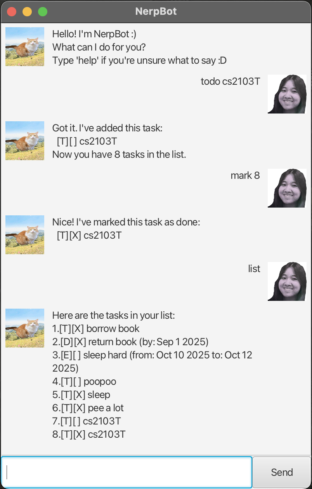

# NerpBot User Guide

NerpBot is a friendly desktop chatbot that helps you manage your tasks quickly and easily, all from a simple GUI
interface.  
With features like adding todos, deadlines, events, and searching your task list, it's the perfect assistant to keep
your life in order.

---

## Features

- Track your tasks with different types (`todo`, `deadline`, `event`)
- Mark tasks as done or undone
- Delete tasks
- Find tasks by keyword
- View tasks in a clear and simple list
- Save and load tasks from a file (`nerpbot.txt`)
- Chat with NerpBot via a clean JavaFX GUI

---

## 💡 Adding deadlines

You can add a deadline task that’s due by a certain date.

- **Command format**:
  deadline /by
- **Example**:
  deadline CS2103T quiz /by Sunday 11:59pm
- **Expected output**:
  Got it. I’ve added this task:
  [D][ ] CS2103T quiz (by: Sunday 11:59pm)
  Now you have 3 tasks in the list.

---

## 📝 Adding todos

Add a simple todo task without any date.

- **Command format**:
  todo
- **Example**:
  todo Buy eggs
- **Expected output**:
  Got it. I’ve added this task:
  [T][ ] Buy eggs
  Now you have 1 task in the list.

---

## 📅 Adding events

Add an event that spans a time period.

- **Command format**:
  event /from /to
- **Example**:
  event Project meeting /from 2pm /to 4pm
- **Expected output**:
  Got it. I’ve added this task:
  [E][ ] Project meeting (from: 2pm to: 4pm)

---

## 🔍 Finding tasks

You can search for tasks that contain a certain keyword.

- **Command format**:
  find
- **Example**:
  find project
- **Expected output**:
  Here are the matching tasks in your list:
  1.[E][ ] Project meeting (from: 2pm to: 4pm)

---

## 🗑 Deleting tasks

Delete a task by its number in the list.

- **Command format**:
  delete
- **Example**:
  delete 2
- **Expected output**:
  Noted. I’ve removed this task:
  [T][X] Buy eggs
  Now you have 2 tasks in the list.

---

## ✅ Marking tasks as done

Mark a task as done using its index.

- **Command format**:
  mark
- **Example**:
  mark 1
- **Expected output**:
  Nice! I've marked this task as done:
  [T][X] Buy eggs

---

## 🔁 Unmarking tasks

Unmark a previously marked task.

- **Command format**:
  unmark
- **Example**:
  unmark 1
- **Expected output**:
- OK, I've marked this task as not done yet:
  [T][ ] Buy eggs

---

## 💾 Saving and loading

All your tasks are saved automatically to `data/nerpbot.txt` and will be loaded again when you reopen the app. No extra
steps needed!

---

## 🚪 Exiting the app

Click the "X" on the window or type:
bye

- You’ll see a goodbye message, and the app will close.

---

*Hope NerpBot makes your life easier and your tasks less scary!*